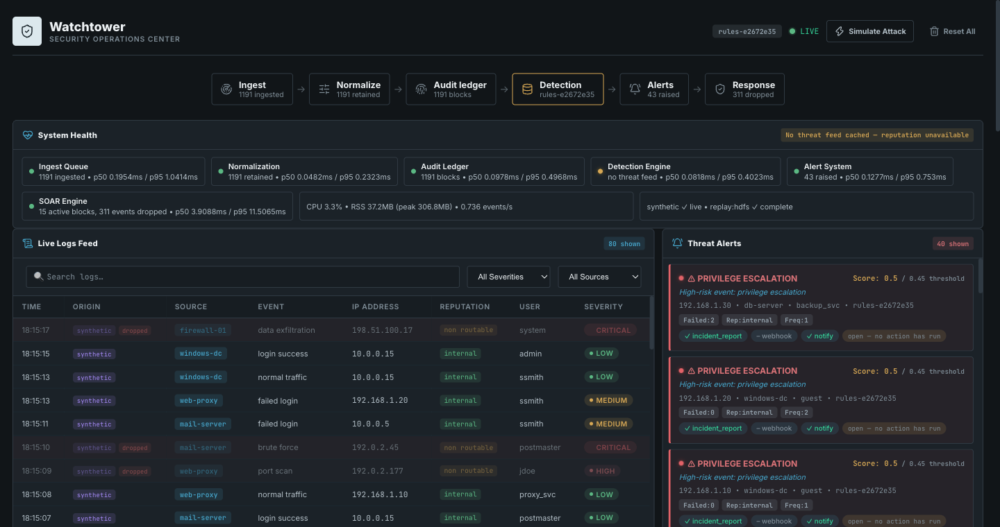
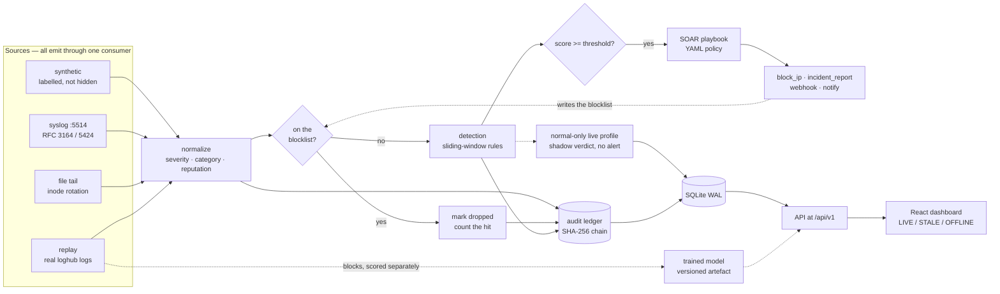
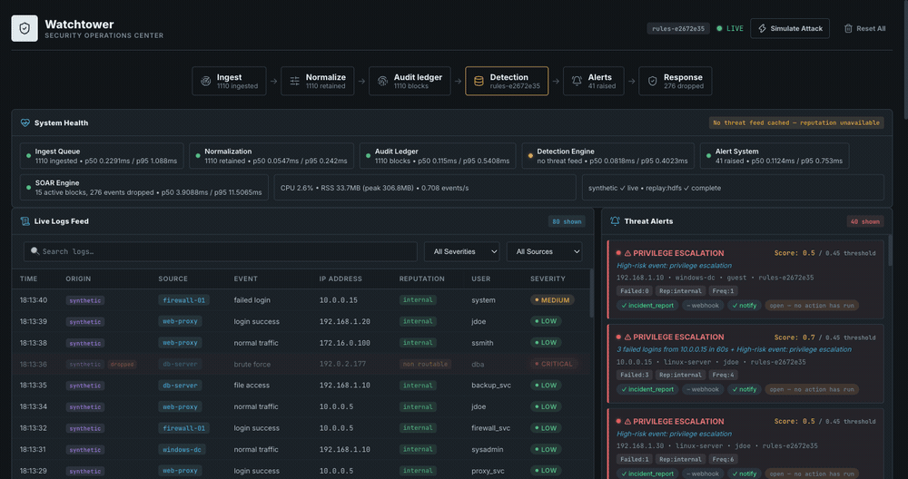
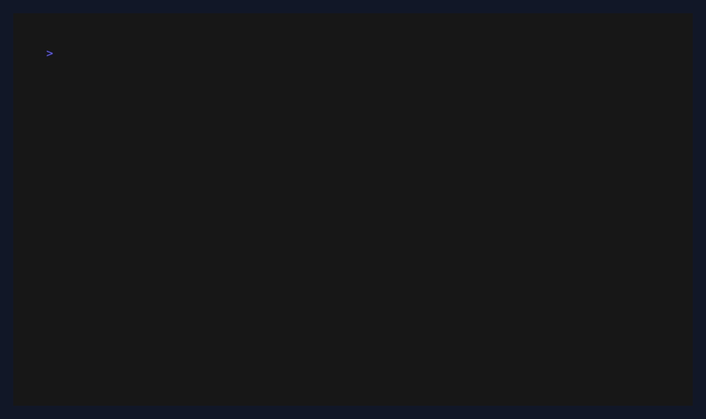

# Watchtower

**A full-stack security-operations MVP for ingesting logs, detecting threats,
orchestrating response playbooks, and preserving verifiable audit trails.**
Watchtower combines multi-source ingestion, deterministic live detection,
application-layer enforcement, and a tamper-evident ledger. A separate Drain3
and scikit-learn pipeline is trained and evaluated on HDFS replay. Flask +
React.



[](LICENSE)
[](backend/requirements.txt)
[](frontend/package.json)

[](https://github.com/Shlok014/watchtower/actions/workflows/ci.yml)

> ### Designed for operations
>
> Watchtower presents source provenance, alert evidence, and action outcomes
> across each stage of the pipeline. Its separate model-evaluation path keeps
> live correlation rules and benchmark performance clear and traceable.

## Architecture

Mermaid rather than a PNG: it renders natively on GitHub in both themes, it
diffs, and it cannot quietly go stale the way an exported image does.



Three things the diagram is making explicit, because each is a decision rather
than an accident:

* **The blocklist is checked before detection**, and the dotted line back from
  the response actions is what makes it a loop rather than a log.
* **The ledger chains events as they arrive** — before anything decides what
  they mean, and whether or not a response suppressed them.
* **The HDFS trained model is off to one side.** It scores replayed HDFS blocks.
  The dashboard's live alerts come from rules; an optional separate live profile
  records shadow verdicts but cannot raise alerts or run SOAR.

## Implemented capabilities

| Component | Current implementation | Status |
|---|---|---|
| **Log ingestion** | Four sources through one pipeline: **UDP syslog** (RFC 3164 + 5424), **file tail** with inode rotation detection, **dataset replay** of real loghub logs, and the synthetic generator. Every event carries a mandatory `origin`, and the dashboard groups by it. | ✅ **real** — synthetic input still available, and labelled |
| Normalization | Severity and event-type classification | ✅ real |
| **IP reputation** | Live lookup against the **Tor Project bulk exit list** (1,380 entries) and **FireHOL level1** (4,580 CIDRs), cached locally with a provenance manifest. Every verdict names its feed and fetch date. Non-routable addresses short-circuit before the lookup. | ✅ **real, measured** |
| Detection (live dashboard) | Sliding-window features (failed logins/60s, event rate/30s) + reputation, weighted. Deterministic: identical input and window state give an identical score. The ruleset fingerprint covers weights, windows, cooldown, threshold, and the file-tail service-account signal. | ✅ real rules — **not** ML, and not called ML |
| Live shadow profile | Offline-fitted normal-window envelope scores those live rule features and stores a separate event-linked verdict. Missing/corrupt profiles and blocked events have explicit states. It does not raise alerts; synthetic replay evidence is [reported separately](docs/METRICS.md#live-shadow-evaluation). | ✅ implemented, **shadow only** |
| **Detection (model)** | **Drain3 template mining → per-block count vectors → scikit-learn**, persisted as a versioned artefact. The miner fits training blocks only; held-out lines can match but cannot create templates. `POST /api/v1/retrain` reports measured deltas. Live replay scores partial blocks and never borrows benchmark F1. | ✅ **real, measured, versioned** |
| Alerting | Threshold 0.45; each alert carries fired rules and evidence. A durable 60-second cooldown per IP and event type prevents repeated alerts and SOAR actions; an analyst unblock resets it. [Real-log alert burden](docs/METRICS.md#openssh-live-rule-replay) is measured separately from detection accuracy. | ✅ real |
| Analyst review | Owner-only `new → investigating → closed` workflow, with reasoned reopening and an append-only decision history. Review state does not change a block or SOAR outcome. | ✅ real |
| **SOAR** | **A closed loop.** YAML playbooks; `block_ip` writes to a blocklist the consumer checks *before* detection, so a blocked address really is suppressed and the drops are counted. Webhooks POST for real. Incident reports are real files citing the ledger blocks that cover their evidence. Alert status is earned: `contained` / `action_failed`, never assumed. | ✅ **real** — enforcement is at the ingestion layer, not a firewall |
| **Audit ledger** | **Tamper-evident within its trust boundary.** Verification recomputes available event digests and block headers, detecting event edits, changed blocks, back-dating, and interior gaps. An external checkpoint is needed to detect a consistent rewrite or deletion of the final block. | ✅ **real** |
| Telemetry | Measured: per-stage p50/p95 via `perf_counter`, real RSS, real CPU, real 60s-window throughput, real uptime | ✅ real, measured |
| **Persistence** | **SQLite in WAL mode.** One transaction per event covers the row, its alert, shadow verdict, and ledger block. The SOAR response runs after that transaction commits. Survives restart. Events retained 24h unless an alert cites them; the ledger is append-only and exempt. | ✅ **real** |
| **Dashboard** | React + Chart.js. **LIVE / STALE / OFFLINE** follows the last successful poll. Rule, shadow, SOAR, and analyst review states are labelled separately; owner controls are disabled in read-only mode. | ✅ **real** |

Live alerting is an intentionally deterministic **rule engine**. Three
sliding-window features and versioned weights make outcomes explainable and
repeatable. The normal-only live profile is an uncalibrated shadow signal;
the separate machine-learning pipeline evaluates HDFS blocks.

### Optional live shadow demo profile

A fresh clone reports `profile_missing` for the shadow signal while rule alerts
continue to work. To install the explicitly synthetic baseline for a local
demo, run from `backend/`:

```bash
python -m eval.live --install-demo-profile
# restart Watchtower to load data/models/live-profile.json
```

The command fits only the declared synthetic normal windows, writes a
digest-checked profile, and prints its synthetic test report. It never promotes
the profile to an alert trigger. The score is a robust deviation, not a
probability of compromise. [The frozen evidence](docs/live-shadow-eval.json)
includes a separate raw-event replay with benign bursts and low-and-slow misses;
its labels come from the scenario generator, not real incident review. Do not
use this demo profile to judge real traffic. `/api/v1/live-shadow/status` shows
which profile, if any, the running process loaded.

An [independently labeled AIT testbed auth-log replay](docs/METRICS.md#independently-labeled-auth-log-replay)
exposed a blind spot: before the service-account `su` rule, Watchtower ingested
all 272 `russellmitchell` auth-log lines as `log_info` and alerted on none of
eight publisher-labeled privilege-escalation lines. The focused rule now alerts
on one of those eight lines and one of 12 labeled lines in a separate AIT
scenario. Most labeled lines remain unalerted; these simulated slices are
neither a production recall estimate nor a claim about SSH brute-force detection.

## Ingestion sources

Four of them, and every one goes through **the same** `process_log`. There is no
separate demo path, so nothing here can be true of the synthetic stream and
false of a real one. Every event carries a mandatory `origin`, which the
dashboard groups by — simulated traffic is *labelled*, not hidden.

```bash
python -m watchtower run --sources synthetic,syslog,file:/var/log/system.log,replay:hdfs@25
```

| Spec | What it is |
|---|---|
| `synthetic` | The generator. Real randomness, producing input data, labelled `origin: synthetic` |
| `syslog[:port]` | UDP listener, RFC 3164 and RFC 5424, default port **5514** |
| `file:<path>` | `tail -F` with inode-based rotation detection |
| `replay:<hdfs\|openssh>[@rate]` | Streams a real loghub dataset through the live pipeline |

### Sample-data terms

The small HDFS and OpenSSH fixtures in `backend/data/samples/` come from
[Loghub](https://github.com/logpai/loghub). They are third-party data and are
excluded from this repository's MIT license; their use and redistribution are
subject to Loghub's terms. Loghub describes its datasets as available for
research or academic work and asks users and distributors to link the upstream
repository and cite its paper where applicable. See
[the third-party notice](docs/THIRD_PARTY_NOTICES.md) before reusing them.

The committed OpenSSH sample contains real-looking, routable addresses from the
source dataset. Treat it as research data, not evidence about those addresses;
public screenshots use an empty feed cache so generated demo addresses are RFC
5737 documentation ranges.

**Replay is the one that matters.** A 2008 HDFS line keeps its 2008 timestamp in
`ts_ms`; `ingested_ts_ms` is when this process saw it. Detection windows and the
dashboard timeline key on ingest time — key them on event time instead and a
replay produces zero detections and a flat timeline while the ingest counter
climbs, which is silent and indistinguishable from a quiet network.

It also stays honest about what the data is. **HDFS is a filesystem log; nothing
in it is an attack.** Lines keep their own level (INFO/WARN/ERROR) and that is
all the severity they get. Mapping "WARN" onto "suspicious_ip" would manufacture
a threat judgement the data never made. Replay demonstrates that real volume
flows through real code — any alert it raises comes from the correlation windows
on real addresses, never from a lookup table of scary words. Measured on this
machine: 167 replayed events, 0 alerts, 0 fabricated threats.

OpenSSH replay and trusted local syslog use the same strict sshd message parser.
Recognized `Failed password`, `Invalid user`, and `Accepted password/publickey`
messages with a valid literal IPv4 or IPv6 actor become authentication events.
`Invalid user` is recorded separately and does not count as a failed password;
sshd often emits both lines for the same attempt.
Malformed or unsupported messages stay generic logs. Replay uses dataset text;
it does not establish the authenticity of that text.

Two details in the syslog listener worth the thirty seconds:

* **Actor attribution is opt-in and local.** By default,
  `WATCHTOWER_TRUSTED_SYSLOG_PEERS` is empty. Every UDP event uses its socket
  peer for correlation. Only a listed **loopback** peer forwarding a strictly
  parsed sshd message can make `ip` the reported actor used for detection and
  response. The actual peer remains `transport_peer_ip` in the event API and
  ledger digest; legacy events have `null`. RFC hostnames remain untrusted.
  Remote UDP source addresses can be spoofed and cannot be configured as
  trusted actors. A local collector must authenticate its own upstream logs;
  this listener does not provide that authentication.
* **Port 5514, not 514,** because 514 needs root and a tool that asks for root
  to accept a datagram has made a bad trade. Note that `logger -n host -P port`
  is util-linux and **the BSD `logger` macOS ships rejects it**. Portable:

```bash
printf '<34>Aug  4 21:00:10 fw sshd[99]: Failed password for root from 198.51.100.4\n' \
  | nc -u -w1 127.0.0.1 5514
```

The file tailer attributes a line to an address found in the message, or to
`127.0.0.1` — the line did come from this host. That has a consequence worth
stating rather than hiding: the 30-second frequency rule counts per address, so
a busy system log will trip it on loopback. That is the rule doing exactly what
it says, and it is why real deployments scope rate rules by source type as well.

The loghub **2k samples are committed** (~1.2 MB), so replay and the
parsing-accuracy eval both run on a clean clone with nothing downloaded.

## Response, and what "enforced" means here

Playbooks are YAML in [`backend/playbooks/`](backend/playbooks) — trigger,
priority, and an ordered list of actions each marked `required` or not.
Detection-to-response policy is configuration, not a dict in a Python file.

```yaml
name: Brute force containment
trigger: brute_force
priority: P1
actions:
  - action: block_ip
    required: true
    ttl_seconds: 3600
  - action: incident_report
    required: true
  - action: webhook
    required: false      # nothing is configured by default, and a missing
                         # notifier must not make containment "fail"
```

### The closed loop

`block_ip` writes to a `blocklist` table. The pipeline consumer checks that
table **before detection runs**, marks matching events `dropped=1`, and counts
the hit against the block that caused it. With the backend started in explicit
local write mode (`WATCHTOWER_ALLOW_LOCAL_WRITES=1`), a live instance showed:

```
$ curl -X POST localhost:5001/api/v1/simulate-attack -H 'Content-Type: application/json' -d '{"attack_type":"brute_force"}'
  Brute Force Attack triggered — 12 malicious events

$ curl localhost:5001/api/v1/blocklist
  192.0.2.45   repeated authentication failures   dropped=10   ttl=3598s
  totals: {active_blocks: 1, events_dropped_lifetime: 10}
```

Twelve synthetic events arrived, one alerted, the address was blocked, and the
remaining ten were **really discarded** before the detector saw them. The input
is simulated; the detect → respond → enforce → observe behavior is actual
application behavior, and `test_blocked_address_produces_no_further_alerts`
fails if any link breaks.



Checked before detection, deliberately: running the rules first and throwing the
verdict away would keep the alert count climbing for an address that is supposed
to be silenced — the "we blocked it" / "then why is it still alerting"
contradiction.

### Scope, stated rather than implied

**Nothing here touches pf, iptables, or any firewall, and nothing needs root.**
Enforcement is at this application's own ingestion layer. *"Real firewall
integration would need pfctl and root; I scoped enforcement to the pipeline"* is
a defensible decision. A `pfctl` wrapper nobody dares demo is not.

The other actions are equally literal:

* **`webhook`** — a real `POST` with a 3-second timeout. Connection refused is
  recorded `failed`, not swallowed: a notifier that silently drops alerts is
  worse than no notifier, because the operator believes someone was told. With
  no `WATCHTOWER_WEBHOOK_URL` set it reports **`skipped`** — "nothing is
  configured" and "it was tried and broke" are different facts.
* **`incident_report`** — writes a real `INC-<date>-<seq>.md` and `.json` with
  the evidence event ids **and the ledger blocks covering them**, so the report
  points at something whose integrity can be independently checked. It also says
  in its own text that it is a record, not a remediation. Report filenames are
  claimed exclusively across concurrent writers, and new report files are
  created with owner-only permissions (`0600`). Untrusted log text is escaped
  in the Markdown view so it cannot forge report sections; stored events retain
  their original text.
* The `malware_detected` playbook deliberately contains **no** `block_ip`. This
  process cannot isolate a host, so it records the incident and says the rest
  was not executed, rather than blocking an address as a substitute for the
  response it could not run.

### Status is earned

| Status | Means |
|---|---|
| `open` | raised; nothing has run |
| `contained` | every required step succeeded **and one had a real side effect** |
| `action_failed` | a required step failed — the alert stays visible |

What this replaced set `alert["status"] = "mitigated"` on the line after
selecting a playbook. Selecting only built a dict, so **every alert in the
system claimed to have been remediated the instant it was raised**, with a green
tick beside each one.

A playbook of `notify` and `webhook` can never reach `contained`. It has told
somebody; it has not fixed anything.

### The ledger covers the enforcement record

`dropped` is inside the payload digest, so flipping it `1 → 0` with raw SQL is
detected. In a system whose claim is that enforcement is real, which traffic was
suppressed is exactly the field worth protecting.

That addition required a second canonicalisation version. Each block records the
serialisation it was written under and is verified with **that one** — otherwise
adding a single field retroactively accuses every historical block of tampering,
and a false alarm is indistinguishable in the output from a real one. Both cases
are tested, along with a block naming a canon this build cannot reproduce, which
reports that it can neither confirm nor refute the digest rather than guessing.

## Threat intelligence

```bash
python -m watchtower.threatintel.fetch            # refresh the feed cache
python -m watchtower.threatintel.fetch --status   # report freshness, fetch nothing
```

Feeds are cached under `backend/data/feeds/` (git-ignored — the data is dated,
third-party, and FireHOL aggregates sources with their own terms) alongside a
manifest recording URL, fetch time, SHA-256 and entry count.

Two details worth knowing, both of which caused real bugs before they were fixed:

* **FireHOL level1 contains RFC1918.** It aggregates `fullbogons`, so
  `10.0.0.0/8`, `192.168.0.0/16`, `172.16.0.0/12` and the RFC 5737 documentation
  ranges are all in the file. A naive "in the netset → malicious" lookup flags
  every internal host in the demo. Address scope is therefore classified *before*
  any feed lookup.
* **Absence from a blocklist scores 0.00.** The previous code gave any
  unrecognised address 0.25 — a quarter of the way to the alert threshold on no
  evidence at all.

With no feeds cached the app still runs: reputation reports `unavailable` and
`checked: false`, and never guesses.

### Demo addresses

The generator draws external addresses from two pools, and the split is
deliberate. Connection-provenance events (`suspicious_ip`, `port_scan`,
`brute_force`) use **real addresses sampled from the cached Tor exit list**, so
the reputation path is genuinely exercised end to end. Events that fabricate
forensic detail — a made-up malware signature, an invented transfer volume — use
**RFC 5737 documentation ranges**, which belong to nobody. Printing an invented
malware accusation next to a real relay operator's address would be inventing
evidence about a real third party.

Naturally this makes the demo's Tor hits self-fulfilling. They demonstrate that
fetch, parse, CIDR matching and citation work end to end; they are not evidence
of detecting real attacks.

## Roadmap

- [x] Remove every fabricated value from scoring, telemetry and retraining
- [x] Real IP reputation from public threat feeds
- [x] SQLite persistence (WAL) replacing shared mutable lists
- [x] Content-addressed hash chain with real tamper detection + a tamper demo
- [x] Drain3 log parsing + a trained model measured on the HDFS_v1 benchmark
- [x] Real ingestion sources: syslog listener, file tailer, dataset replay
- [x] The trained model wired into replay, versioned, with a real retrain endpoint
- [x] A SOAR blocklist the pipeline actually enforces
- [x] Tests + CI + a detection-regression gate
- [x] A dashboard that says when its data is stale or its backend is gone
- [x] Live dashboard evidence, an animated attack-to-enforcement capture, and a ledger-tamper demonstration
- [x] A green CI run on `main` for the repaired baseline
- [ ] Kafka or Redis as the transport, replacing the in-process consumer
- [ ] Server-sent events, replacing 2-second polling
- [ ] Merkle proofs, so a single block can be verified without the whole chain
- [ ] TypeScript

The last four are honest wants, not work in progress. Each was considered and
deliberately not done: a broker and SSE are infrastructure this does not yet
need, Merkle proofs solve a problem one trusted writer does not have, and a
day of TypeScript migration bought less than a day of tests and error handling.

## Measured results

Full numbers, and how to reproduce them: **[docs/METRICS.md](docs/METRICS.md)**.
Every figure there is emitted by `python -m eval.benchmark`; none is typed by
hand.

> **Evaluation protocol:** The split happens before template mining. Drain sees
> training blocks only; 5,588,020 of 5,588,021 held-out lines matched that
> frozen vocabulary. No line in the full dataset mentioned blocks on both
> sides of this split. The older transductive results were superseded by this
> full HDFS_v1 rerun. See [the measured results page](docs/METRICS.md).

**Log parsing** — grouping accuracy against loghub's ground-truth templates:

| Dataset | True templates | Mined | Grouping accuracy |
|---|---:|---:|---:|
| HDFS_2k | 14 | 16 | **0.9975** |
| OpenSSH_2k | 27 | 23 | **0.7180** |

**Anomaly detection** — loghub HDFS_v1, all 11,175,629 lines, 575,061 labelled
blocks (2.93% anomalous), 45 mined templates, stratified 50/50 split at seed 42:

| Model | Supervised | Precision | Recall | F1 | ROC-AUC |
|---|---|---:|---:|---:|---:|
| LogisticRegression | yes | 0.9605 | 0.9998 | **0.9797** | 0.9994 |
| DecisionTree | yes | 0.9986 | 0.9986 | **0.9986** | 0.9996 |
| IsolationForest | no | 0.1969 | 0.7150 | **0.3087** | 0.9465 |

Parse-and-featurise throughput: **89,055 lines/sec** (125.5s to read, mine,
and featurise 11.2M lines over three passes). This benchmark excludes storage,
ledger hashing, live detection, alerting, and SOAR.

Three things worth saying plainly rather than letting the table imply otherwise:

* **HDFS is a near-separable benchmark.** F1 above 0.95 on template count
  vectors is the expected result here and matches published loglizer baselines.
  It is not evidence of anything novel in this repo.
* **The IsolationForest row is genuinely unsupervised.** It fits every training
  row without labels and uses a fixed automatic threshold. Its 0.3087 F1 is a
  comparison to the supervised models, not a score for the live dashboard.
* **These results are about HDFS, not the dashboard.** The live stream is
  synthetic and its detection is a rule engine. The two are deliberately
  separate and neither page claims otherwise.

Both the OpenSSH row and the IsolationForest row could have been quietly
omitted. They are here because a results table that only contains its best
numbers is not a results table.

### The model is a versioned artefact, not a script output

The LogisticRegression row comes from a persisted model. `POST /api/v1/retrain`
refits it, evaluates it on the same frozen held-out half, and returns what
changed. Each version records its seed, its split indices, its sklearn version,
its parameters, and a SHA-256 of the exact feature matrix it saw.

For an unchanged cached matrix, the endpoint returns the persisted model
version, measured metrics, the prior version's metrics, and `delta_f1: 0.0`.

**`delta_f1: 0.0`** confirms that retraining on unchanged data produces an
unchanged evaluation result. The endpoint returns measured fit time, versioned
metadata, metrics, and deltas from the persisted prior model.

Cached retraining uses the persisted matrix for 575,061 blocks because the feature
matrix is cached alongside the template ids that define its columns. The cache
is reused only when the log, labels, and miner state hashes still match. Full
and sample runs have separate miner state; a sample smoke run cannot replace
the active full model. Live scoring refuses a model whose miner hash differs.

### The model in the live pipeline

`--sources replay:hdfs` scores blocks as their lines arrive, using
`parser.match()` — never `parse()`, which would mint a template for an unseen
line and hand the model a column index that means nothing.

**The published F1 does not transfer to those scores, and `/api/v1/model` says
so on every verdict it returns.** It was measured on complete blocks; scoring a
block that is three lines old is the same model answering a harder question. So
that endpoint reports a probability, the number of lines behind it, the observed
min/median/max of recent scores, and how many lines matched no template at all —
a rising unmatched rate being the honest signal that the miner has drifted. No
accuracy is claimed for live scoring anywhere.

## Dashboard reliability

The React dashboard derives LIVE, STALE, and OFFLINE states from the age of the
last successful API poll. It surfaces backend errors and distinguishes empty,
filtered, and offline states.

The API client validates HTTP status and JSON content, surfaces backend errors,
and prevents failures from being presented as empty data. Polling remains stable
across filter changes and does not queue overlapping requests against a slow
backend.

The frontend is organized into 16 focused components with a dedicated API
client and polling hook. `VITE_API_URL` configures the API endpoint for local or
deployed environments, and JSDoc typedefs document the API boundary.

## Storage

State lives in `backend/data/watchtower.db` (SQLite, WAL). It replaced four
module-level Python lists that a background thread appended to and popped from
while Flask handlers iterated them, with no lock held — and a ledger written to
JSON on every twentieth block inside a bare `except Exception: pass`.

Measured on this machine (Python 3.14, macOS/arm64):

**Measured, and re-measurable: [docs/STORAGE.md](docs/STORAGE.md), generated by
`make perf`.** Concurrent write throughput, the cost of a benign event versus an
alerting one, `/api/v1/stats` latency, and ledger growth per block.

Those numbers used to sit here, hand-typed, measured once and never re-checked —
through a blocklist lookup added ahead of detection, the ledger moving earlier in
the pipeline, `dropped` entering the digest, and the SOAR response splitting into
several transactions. When I finally re-measured, the write figure had moved by
about half. A number that has to be remembered is a number that goes stale, so
they are generated now and `scripts/check_published_numbers.py` fails the build
if this page drifts from them.

The one worth knowing without clicking: `/api/v1/stats` came down from **13.0 ms**
to under **2 ms**, because the old version re-parsed every timestamp once per
time bucket — roughly 75,000 `fromisoformat` calls per request, every 2 seconds.

That last row is a real constraint, not a footnote: the ledger is append-only
and exempt from retention, because an audit ledger you silently truncate is not
an audit ledger. `auto_vacuum=INCREMENTAL` is set before the first table is
created — set afterwards it is silently ignored and the file then only ever
grows.

Two schema decisions worth calling out:

* **Events carry both `ts_ms` and `ingested_ts_ms`.** Detection windows and
  dashboard buckets key on ingest time. Keying them on event time would mean a
  replayed 2008 dataset produces zero detections and a flat-zero timeline while
  the ingest counter climbs — a silent failure that looks exactly like a quiet
  network.
* **`origin` is checked with `GLOB`, not `LIKE`.** SQLite's `LIKE` is ASCII
  case-insensitive, so `LIKE 'replay:%'` also accepts `REPLAY:` and `Replay:`,
  and two spellings of one provenance makes every `GROUP BY origin` under-count.

## The audit ledger

A single-writer hash chain — the data structure inside a blockchain, without the
consensus, because there is exactly one trusted writer. It is not distributed,
there is no proof-of-work, and it is not Hyperledger.

The previous version compared each block's `prev_hash` against its predecessor's
`hash` and nothing else. Both live in the same row, so it verified that two
stored strings matched — it never recomputed a digest from the data it claimed
to protect. Editing a log entry passed. It reported `blocks_checked: N` while
checking nothing about those blocks' contents.

Try it:

```bash
cd backend
.venv/bin/python -m watchtower ledger verify
# ✅ 26 present blocks verified — all available digests match.
#    No external checkpoint: deletion of a final block cannot be detected.

.venv/bin/python -m watchtower ledger tamper --event-id 7 --field message --value "nothing happened here"
#   event 7.message
#     before: '[SYSLOG] admin accessed /etc/shadow from 192.168.1.30'
#     after:  'nothing happened here'

.venv/bin/python -m watchtower ledger verify
# ❌ TAMPER DETECTED — 1 finding(s) across 26 blocks.
#   height 7 (block 7): payload_mismatch
#     event 7 was modified after it was recorded (stored 3e43b48f0e26…, recomputed 3218805befed…)
```



`tamper` issues a raw SQL UPDATE that bypasses the application, which is the
only honest way to demonstrate the property — anything routed through the app
would re-chain the block and detect nothing.

Verification distinguishes five outcomes: `payload_mismatch` (the event was
edited), `header_mismatch` (the ledger row was edited), `chain_break`,
`height_gap` (an interior block was deleted), and `pruned` — an event removed by
retention, which is reported rather than treated as tampering.

The chain alone cannot detect an attacker who controls the entire database and
recomputes every affected hash. It also cannot detect a missing final block:
there is no later link or height gap to expose it. To make those attacks
detectable, export a
checkpoint after a clean verification and preserve the resulting file outside
the database owner's control (for example, in a separately administered vault):

```bash
cd backend
.venv/bin/python -m watchtower ledger checkpoint --output /secure/off-host/watchtower-checkpoint.json
.venv/bin/python -m watchtower ledger verify --checkpoint /secure/off-host/watchtower-checkpoint.json
```

The checkpoint records a block height and SHA-256 head hash. Verification checks
the full chain and that the anchored block still has the saved hash; newer
blocks may have been appended. The command refuses an empty or invalid chain,
and never overwrites an existing checkpoint. An attacker who can replace the
checkpoint can still forge the evidence; this is an external trust anchor, not
a signature, timestamp authority, or proof that the original events were true.

One implementation note worth reading if you ever build one of these: the digest
covers `ts_ms`, the stored integer, not the ISO-8601 string. Hashing the ISO
form on write and reconstructing it from milliseconds on verify silently loses
sub-millisecond precision, and every block in the chain then reports as
tampered. That bug is completely invisible until verification actually
recomputes something — which is the whole point.

## Tests

```bash
cd backend  && .venv/bin/python -m pytest
cd frontend && npm test
```

Backend tests cover the HTTP contract, the four ingestion sources (including a real
UDP datagram end to end, and a tailer surviving both rotation and in-place
truncation), the SOAR closed loop (blocked address → zero further alerts, N real
drops), playbook validation, a webhook against a real HTTP server and a closed
port, model versioning and the zero-delta retrain, bounded live block scoring,
provenance constraints, concurrent writers against a live
reader, retention (including that an alert-referenced event is never pruned and
that lifetime counters do not fall when it runs), transaction rollback leaving a
usable connection, restart durability, and every ledger tamper mode — event
edits across four columns, forged block digests, deleted blocks, back-dating,
and 600 appends yielding 600 contiguous ids (the original code produced id 501
forever).

## Running it

```bash
make setup     # both dependency trees
make dev       # API on :5001, dashboard on :5173
```

`make help` lists everything. The ones worth knowing:

| | |
|---|---|
| `make test` | Backend and frontend suites |
| `make lint` | ruff, eslint, and the honesty gate |
| `make bench` | regenerate `docs/METRICS.md` from a real run |
| `make demo` | verify the ledger, corrupt one event with raw SQL, verify again |
| `make feeds` | refresh the cached threat feeds |
| `make data` | download the full HDFS_v1 benchmark (~1.5 GB extracted) |

`SOURCES=synthetic,syslog,replay:hdfs@25 make dev` picks the ingestion sources.

`scripts/dev.sh` replaces the old `start.sh`, whose first line was
`lsof -ti:5001 | xargs kill -9` — that kills whatever owns the port, not what
this project started, on a Mac where 5001 is also AirPlay Receiver. The
replacement only ever signals the two children it launched, and fails by name if
the port is taken.

**A clean clone needs no downloads.** The loghub 2k samples and their labels are
committed, so `make test`, `make bench`'s parsing section, and `replay:hdfs` all
work immediately.

## Layout

```
backend/
  watchtower/          the application package
    config.py          every WATCHTOWER_* setting, resolved once
    app.py             create_app() factory
    api/routes.py      the HTTP surface, at /api/v1
    pipeline/          normalize.py, consumer.py — one path for every source
    detect/            rules.py (live), parser.py + features.py (benchmark)
    sources/           base.py, synthetic.py
    soar/engine.py     playbook selection
    ledger/chain.py    the tamper-evident audit chain
    store/             db.py, repos.py, schema.sql
    telemetry/         measured, never invented
    threatintel/       cached public feeds + provenance
  eval/                benchmarks; writes docs/METRICS.md
  datasets/            loghub download
  tests/
```

The API is versioned at `/api/v1` and there is no unversioned alias. Two of
these responses have already changed meaning during the rebuild — `links_ok` on
the chain check, `playbook_steps` on SOAR — and a client pinned to `/api` can
only discover that by rendering an empty cell, since every field the dashboard
reads is optional-chained.

## Configuration

Everything is an environment variable with a working default, so the app runs
with none of them set. `python -m watchtower config` prints what a process
resolved, and `GET /api/v1/config` reports it from a running one.

| Variable | Default | |
|---|---|---|
| `WATCHTOWER_DATA_DIR` | `backend/data` | database, feed cache, drain state |
| `WATCHTOWER_DB` | `<data>/watchtower.db` | |
| `WATCHTOWER_RETENTION_HOURS` | `24` | events only; the ledger is exempt |
| `WATCHTOWER_ALERT_THRESHOLD` | `0.45` | changing it changes `ruleset_version` |
| `WATCHTOWER_SOURCES` | `synthetic` | comma-separated |
| `WATCHTOWER_TRUSTED_SYSLOG_PEERS` | unset | exact loopback IP literals for local collectors allowed to forward sshd actors; empty by default |
| `WATCHTOWER_CORS_ORIGINS` | `http://localhost:5173,http://127.0.0.1:5173` | |
| `WATCHTOWER_TRUSTED_HOSTS` | `localhost,127.0.0.1` | Host allowlist; add an intended hostname explicitly |
| `WATCHTOWER_HOST` / `WATCHTOWER_PORT` | `127.0.0.1` / `5001` | |
| `WATCHTOWER_ALLOW_LOCAL_WRITES` | unset | Set to `1` for tokenless writes during local development only |
| `WATCHTOWER_WRITE_TOKEN` | unset | Server-only owner token, at least 32 characters; required for writes over a public host |

The server binds loopback by default. CORS limits who can read responses, but
it cannot stop a cross-site HTML form from posting to `/reset`. Unsafe requests
now reject unapproved browser `Origin` headers and cross-site Fetch Metadata;
Flask rejects untrusted Host headers to prevent DNS rebinding into loopback.
State-changing API requests are **read-only by default**, even on loopback. For
local development with the dashboard controls enabled, start the backend with
`WATCHTOWER_ALLOW_LOCAL_WRITES=1`; this works only when the bind address,
trusted hosts, request Host and connecting peer are all loopback. Do not enable
that flag behind a reverse proxy. On a public host, a synthetic-only demo is
readable while Simulate, Retrain, Reset and Unblock are disabled. If any real
source is configured or real-origin events remain in the store, anonymous API
reads also return `403 read_forbidden`; a public dashboard must not expose real
log text, usernames, addresses, or incident details. An owner can configure
`WATCHTOWER_WRITE_TOKEN` on the server and send `Authorization: Bearer <token>`
from a private API client over HTTPS to read and write. The token is never put
in the frontend bundle or returned by `/config`. `GET /api/v1/access` reports
both `can_read` and `can_write` for the current request.
Read-only `/config` and `/playbooks` responses show path basenames instead of
absolute server paths. Public `/playbooks` also omits operator-supplied action
parameters, including webhook URLs. Webhook execution details never store a
URL, and API reads redact older webhook details that may contain one.

## License

MIT — see [LICENSE](LICENSE).
